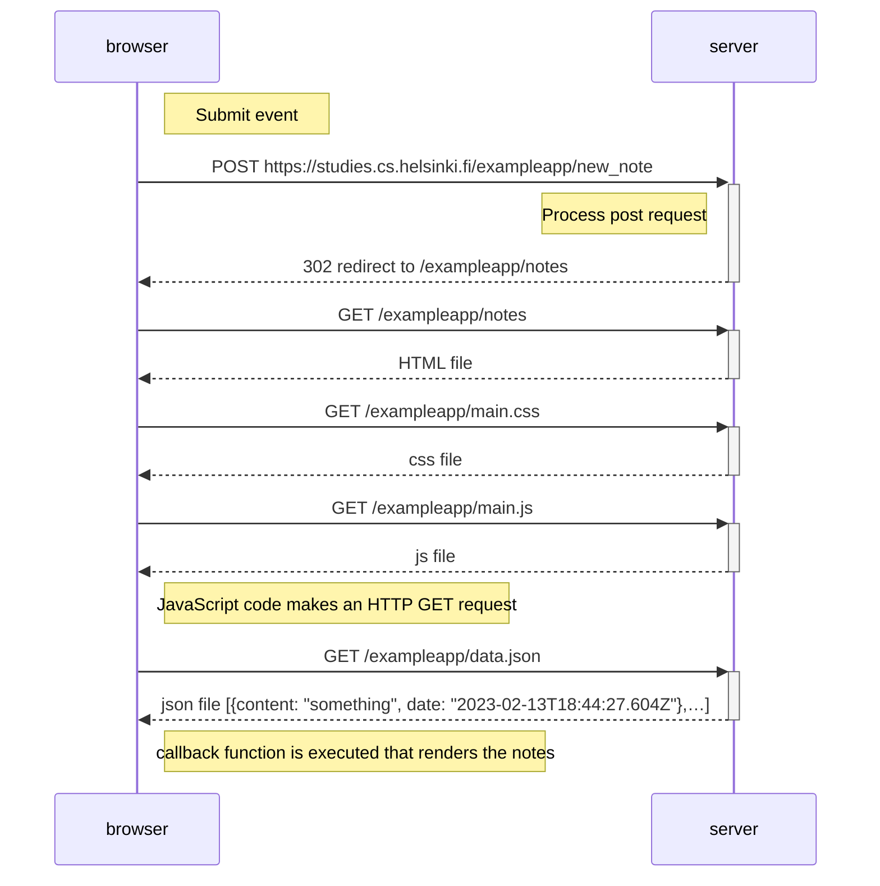

```mermaid
sequenceDiagram
    participant b as browser 
    participant s as server
    
    Note right of b: Submit event
    b->>+s: POST https://studies.cs.helsinki.fi/exampleapp/new_note
    Note left of s: Process post request
    s-->>-b: 302 redirect to /exampleapp/notes

    b->>+s: GET /exampleapp/notes
    s-->>-b: HTML file
    
    b->>+s: GET /exampleapp/main.css
    s-->>-b: css file

    b->>+s: GET /exampleapp/main.js
    s-->>-b: js file

    Note right of b: JavaScript code makes an HTTP GET request 

    b->>+s: GET /exampleapp/data.json
    s-->>-b: json file [{content: "something", date: "2023-02-13T18:44:27.604Z"},…]

    Note right of b: callback function is executed that renders the notes
```