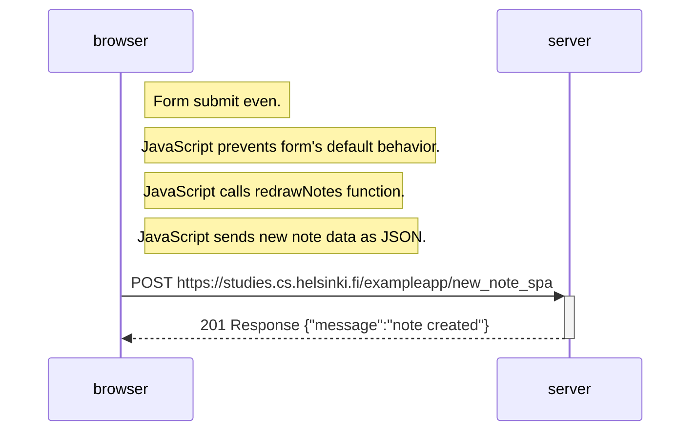

```mermaid
sequenceDiagram
    participant b as browser
    participant s as server

    Note right of b: Form submit even.
    Note right of b: JavaScript prevents form's default behavior.
    Note right of b: JavaScript calls redrawNotes function.
    Note right of b: JavaScript sends new note data as JSON.

    b->>+s: POST https://studies.cs.helsinki.fi/exampleapp/new_note_spa
    s-->>-b: 201 Response {"message":"note created"}
```