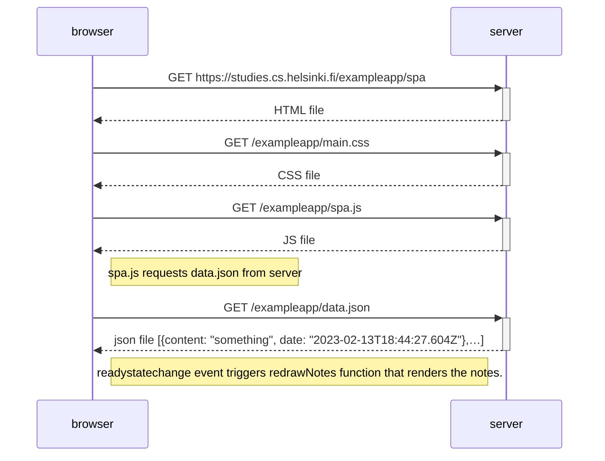

```mermaid
sequenceDiagram
    participant b as browser
    participant s as server

    b->>+s: GET https://studies.cs.helsinki.fi/exampleapp/spa
    s-->>-b: HTML file

    b->>+s: GET /exampleapp/main.css
    s-->>-b: CSS file

    b->>+s: GET /exampleapp/spa.js
    s-->>-b: JS file

    Note right of b: spa.js requests data.json from server 

    b->>+s: GET /exampleapp/data.json
    s-->>-b: json file [{content: "something", date: "2023-02-13T18:44:27.604Z"},…]

    Note right of b: readystatechange event triggers redrawNotes function that renders the notes.
```